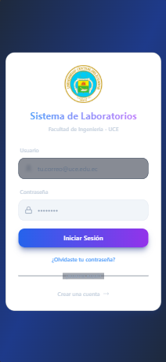
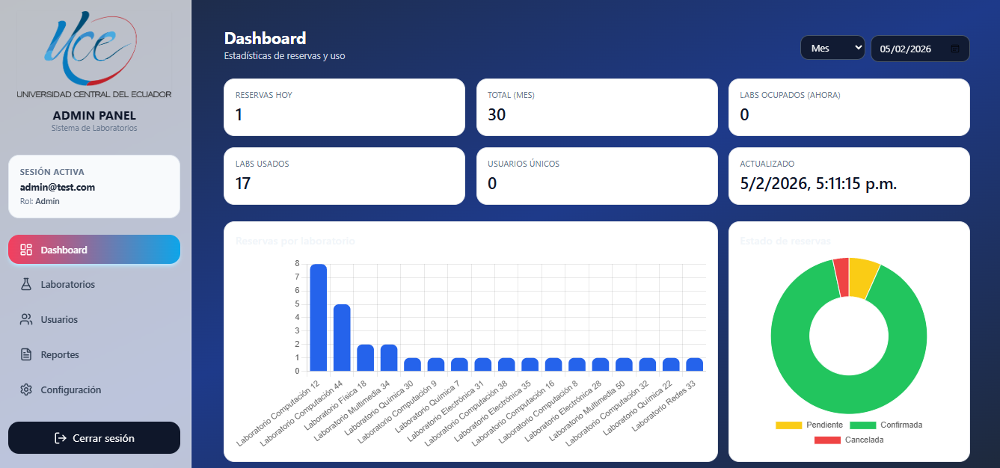
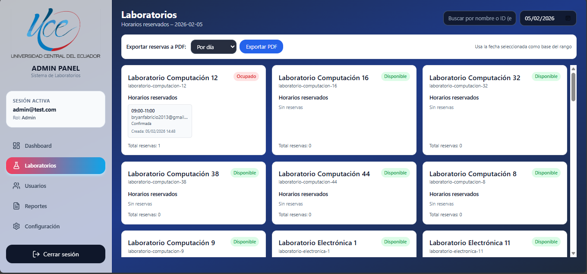
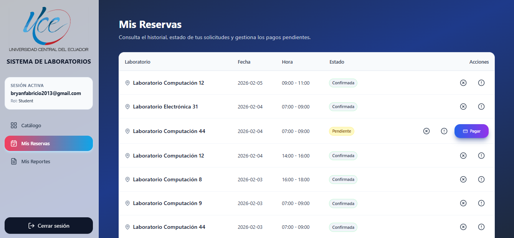

# 🧪 Laboratory Reservation Management System

### Full-Stack Application | AWS EC2 + Nginx + Cloudflare Production Deployment

A **production-ready laboratory reservation platform** designed for academic institutions at **Universidad Central del Ecuador (UCE)**. The system supports **basic and premium lab reservations**, **secure online payments**, **incident reporting with metadata**, and a **role-based admin dashboard** with real-time analytics.

**🌐 Live Application:** [https://bryan_chileno_1.programacionwebuce.net/](https://bryan_chileno_1.programacionwebuce.net/)

**Live deployment on AWS EC2 with Nginx reverse proxy + Cloudflare CDN** following real-world DevOps and security best practices.



---

## ✨ Key Features Overview

### 🎓 Student & Professor Features

* **Firebase Authentication** - Secure login with Google OAuth and email/password
* **Laboratory Catalog** - Browse available labs with real-time availability
* **Smart Reservations** - Book basic and premium laboratory sessions
* **Priority System** - Professors get priority access to labs
* **Stripe Integration** - Secure online payments for premium reservations
* **Email Notifications** - Automatic confirmations for bookings and payments
* **Reservation History** - Track all your past and upcoming reservations
* **Incident Reporting** - Submit reports with image uploads and automatic metadata capture
* **Dashboard** - Personalized view of reservations and activity



### 🛠️ Admin Features

* **Role-Based Access Control** - Admin and professor roles with specific permissions
* **User Management** - Manage student and professor accounts with real-time updates
* **Laboratory Configuration** - Control lab availability and schedules
* **Reservation Monitoring** - Real-time view of all laboratory bookings
* **Incident Reports Dashboard** - Review and manage submitted reports with metadata
* **Analytics** - Statistics on usage, popular labs, top users, and revenue
* **System Configuration** - Manage operating hours and reservation rules
* **Search & Filters** - Debounced search with advanced filtering



---

## 🏗️ System Architecture

### Production Deployment with Cloudflare CDN

```
                    User (Browser)
                          │
                          ▼
              ┌───────────────────────┐
              │   Cloudflare CDN      │
              │ (DNS + SSL + Cache)   │
              └───────────┬───────────┘
                          │
                          ▼
              ┌───────────────────────┐
              │     AWS EC2 t2.medium │
              │  Ubuntu 22.04 LTS     │
              │                       │
              │  ┌─────────────────┐  │
              │  │ Nginx (80/443)  │  │
              │  └────────┬────────┘  │
              │           │           │
              │  ┌────────┴────────┐  │
              │  │                 │  │
              │  ▼                 ▼  │
              │ ┌─────┐        ┌─────┐ │
              │ │React│        │Node │ │
              │ │:5173│        │:5000│ │
              │ └─────┘        └──┬──┘ │
              └─────────────────│──────┘
                                │
              ┌─────────────────┼─────────────────┐
              │                 │                 │
              ▼                 ▼                 ▼
        ┌──────────┐      ┌──────────┐    ┌──────────┐
        │ Firebase │      │ MongoDB  │    │  Stripe  │
        │ Auth/DB  │      │ Reports  │    │ Payments │
        └──────────┘      └────┬─────┘    └──────────┘
                               │
                               ▼
                        ┌──────────────┐
                        │ Backblaze B2 │
                        │Image Storage │
                        └──────────────┘
```

### Technology Stack

**Frontend:**
- React 18 with Vite
- TailwindCSS for styling
- React Query for data fetching and caching
- React Router for navigation
- Luxon for date/time management
- React Hot Toast for notifications
- Lucide React for icons

**Backend:**
- Node.js + Express 5
- Firebase Admin SDK
- Stripe SDK for payments
- MongoDB with Mongoose
- AWS S3 SDK (Backblaze B2)
- Multer for file uploads (15MB limit)
- Winston for logging

**Infrastructure:**
- AWS EC2 (Ubuntu 22.04 LTS)
- Cloudflare (CDN, DNS & SSL)
- Nginx (reverse proxy)
- Docker & Docker Compose
- Firebase (Authentication & Firestore)
- MongoDB (incident reports)
- Backblaze B2 (private image storage)

---

## 🆕 Recent Features (February 2026)

### ✨ Image Metadata Capture System

Automatic metadata extraction for incident report images:

**Technical Metadata:**
- Image dimensions (width × height)
- File size and format (JPEG, PNG, WebP)
- Upload timestamp

**Device Information:**
- Browser detection (Chrome, Firefox, Edge, Safari)
- Operating system (Windows, macOS, Linux, iOS, Android)
- Screen resolution
- User agent string

**Implementation:**
- Frontend utility for metadata extraction
- Backend storage in MongoDB
- 15MB payload support
- Metadata displayed in admin dashboard

### ✅ Form Validation Enhancements

**Title Validation:**
- Real-time validation for report titles
- Accepts only letters and spaces (including Spanish accents: á, é, í, ó, ú, ñ)
- Blocks numbers and special characters
- Immediate user feedback

**UI Improvements:**
- Fixed label visibility in light/dark themes
- Improved contrast ratios for accessibility
- Consistent styling across all forms
- Single toggle button for image viewing

### 🎯 Priority System Fixes

**Reservation Display:**
- Student reservations show "Ocupado" (Occupied)
- Professor reservations show "Prioridad" (Priority)
- Correct badge colors and variants
- Fixed catalog display logic

---

## 📁 Project Structure

```
gestion_laboratorios/
├── Backend/
│   ├── controllers/          # Request handlers
│   │   ├── reporteController.js  # Image + metadata handling
│   │   ├── reservasController.js # Priority logic
│   │   └── dashboardController.js
│   ├── middleware/           # Auth & validation
│   │   ├── multerUpload.js   # 15MB file limit
│   │   └── authMiddleware.js
│   ├── models/               # MongoDB schemas
│   │   └── Reporte.js        # With imagenMetadata field
│   ├── routes/               # API endpoints
│   ├── services/             # Business logic
│   │   └── b2Upload.service.js # Backblaze integration
│   ├── config/               # Firebase & logging
│   ├── realtime/             # Firestore listeners
│   ├── Dockerfile
│   ├── .env
│   └── server.js             # 15MB payload limits
├── Frontend/
│   ├── src/
│   │   ├── features/         # Feature-based modules
│   │   │   ├── admin/        # Admin dashboard
│   │   │   │   ├── dashboard/    # Analytics
│   │   │   │   ├── users/        # User management
│   │   │   │   ├── labs/         # Lab config
│   │   │   │   └── reports/      # Incident reports
│   │   │   ├── auth/         # Login & register
│   │   │   ├── catalog/      # Lab catalog
│   │   │   ├── my-reservations/  # User reservations
│   │   │   ├── reportes/     # Incident submission
│   │   │   └── payments/     # Stripe checkout
│   │   ├── shared/           # Shared components
│   │   │   ├── components/   # Reusable UI
│   │   │   └── utils/        # Utilities
│   │   │       └── imageMetadata.js  # Metadata extraction
│   │   ├── hooks/            # Custom React hooks
│   │   ├── services/         # API clients
│   │   └── App.jsx
│   ├── Dockerfile
│   ├── .env
│   └── vite.config.js
├── screenshots/              # Project screenshots
├── docker-compose.yml
└── README.md
```

---

## 🚀 Quick Start

### Prerequisites

- Docker & Docker Compose installed
- Firebase project setup
- Stripe account (with test keys)
- Backblaze B2 bucket
- Node.js 18+ (for local development)

### 1. Clone the Repository

```bash
git clone https://github.com/BryanS1996/Gestion_Laboratorios.git
cd gestion_laboratorios
```

### 2. Configure Environment Variables

**Backend (.env)**
```env
PORT=5000
NODE_ENV=production

# Firebase
FIREBASE_PROJECT_ID=your_project_id

# Stripe
STRIPE_SECRET_KEY=sk_test_...
STRIPE_WEBHOOK_SECRET=whsec_...

# Backblaze B2
B2_KEY_ID=your_key_id
B2_APPLICATION_KEY=your_app_key
B2_BUCKET_NAME=your_bucket
B2_ENDPOINT=https://s3.us-west-000.backblazeb2.com

# MongoDB
MONGO_URI=mongodb://mongo:27017/laboratorios
```

**Frontend (.env)**
```env
# Local Development
VITE_API_URL=http://localhost/api

# Production with Cloudflare + Nginx
# VITE_API_URL=https://bryan_chileno_1.programacionwebuce.net/api

VITE_STRIPE_PUBLIC_KEY=pk_test_...

# Firebase Config
VITE_FIREBASE_API_KEY=your_api_key
VITE_FIREBASE_AUTH_DOMAIN=your_domain
VITE_FIREBASE_PROJECT_ID=your_project_id
VITE_FIREBASE_STORAGE_BUCKET=your_bucket
VITE_FIREBASE_MESSAGING_SENDER_ID=your_sender_id
VITE_FIREBASE_APP_ID=your_app_id
```

### 3. Start the Application

**With Docker Compose (Recommended):**
```bash
# Build and start all services
docker compose up --build

# Or run in detached mode
docker compose up -d --build
```

**Local Development:**
```bash
# Terminal 1 - Backend
cd Backend
npm install
npm run dev

# Terminal 2 - Frontend
cd Frontend
npm install
npm run dev

# Terminal 3 - MongoDB
docker run -d -p 27017:27017 mongo:latest
```

### 4. Access the Application

**Local Development:**
- **Frontend:** http://localhost:5173
- **Backend API:** http://localhost:5000
- **API Health:** http://localhost:5000/health
- **Mongo Express:** http://localhost:8081 (dev only)

**Production:**
- **Live Application:** [https://bryan_chileno_1.programacionwebuce.net/](https://bryan_chileno_1.programacionwebuce.net/)
- **API Endpoint:** https://bryan_chileno_1.programacionwebuce.net/api
- **API Health:** https://bryan_chileno_1.programacionwebuce.net/api/health



---

## ☁️ Production Deployment (AWS EC2 + Cloudflare)

### Infrastructure Overview

**Current Production Setup:**
- **Domain:** [bryan_chileno_1.programacionwebuce.net](https://bryan_chileno_1.programacionwebuce.net/)
- **CDN:** Cloudflare (DNS, caching, DDoS protection)
- **Server:** AWS EC2 Instance (t2.medium)
- **OS:** Ubuntu 22.04 LTS
- **Reverse Proxy:** Nginx
- **SSL/TLS:** Cloudflare SSL + Let's Encrypt
- **Containers:** Docker & Docker Compose

### EC2 Instance Requirements

- **Instance Type:** t2.medium or larger (2 vCPU, 4GB RAM)
- **OS:** Ubuntu 22.04 LTS
- **Storage:** 20GB minimum
- **Security Group Rules:**
  - SSH (22) - From your IP
  - HTTP (80) - From 0.0.0.0/0
  - HTTPS (443) - From 0.0.0.0/0

### Initial EC2 Setup

```bash
# 1. SSH into your EC2 instance
ssh -i your-key.pem ubuntu@<EC2_PUBLIC_IP>

# 2. Update system
sudo apt update && sudo apt upgrade -y

# 3. Install Docker
sudo apt install -y docker.io docker-compose
sudo usermod -aG docker ubuntu
newgrp docker

# 4. Install Nginx
sudo apt install -y nginx

# 5. Install Certbot (for SSL)
sudo apt install -y certbot python3-certbot-nginx
```

### Nginx Configuration

**Create Nginx config: `/etc/nginx/sites-available/laboratorios`**

```nginx
# HTTP - Redirect to HTTPS (Cloudflare handles SSL)
server {
    listen 80;
    server_name bryan_chileno_1.programacionwebuce.net;
    
    # Allow certbot (backup SSL)
    location /.well-known/acme-challenge/ {
        root /var/www/html;
    }
    
    location / {
        return 301 https://$host$request_uri;
    }
}

# HTTPS
server {
    listen 443 ssl http2;
    server_name bryan_chileno_1.programacionwebuce.net;
    
    # SSL Configuration (managed by certbot + Cloudflare)
    ssl_certificate /etc/letsencrypt/live/bryan_chileno_1.programacionwebuce.net/fullchain.pem;
    ssl_certificate_key /etc/letsencrypt/live/bryan_chileno_1.programacionwebuce.net/privkey.pem;
    
    # Security headers
    add_header X-Frame-Options "SAMEORIGIN" always;
    add_header X-Content-Type-Options "nosniff" always;
    add_header X-XSS-Protection "1; mode=block" always;
    
    # Frontend (React SPA)
    location / {
        proxy_pass http://localhost:5173;
        proxy_http_version 1.1;
        proxy_set_header Upgrade $http_upgrade;
        proxy_set_header Connection 'upgrade';
        proxy_set_header Host $host;
        proxy_cache_bypass $http_upgrade;
    }
    
    # Backend API
    location /api {
        proxy_pass http://localhost:5000;
        proxy_http_version 1.1;
        proxy_set_header Host $host;
        proxy_set_header X-Real-IP $remote_addr;
        proxy_set_header X-Forwarded-For $proxy_add_x_forwarded_for;
        proxy_set_header X-Forwarded-Proto $scheme;
        
        # Increased limits for image uploads
        client_max_body_size 20M;
    }
}
```

### Application Deployment

```bash
# 1. Clone repository
git clone https://github.com/BryanS1996/Gestion_Laboratorios.git
cd gestion_laboratorios

# 2. Configure environment variables
nano Backend/.env
nano Frontend/.env

# Important: Update Frontend/.env for production
# VITE_API_URL=https://bryan_chileno_1.programacionwebuce.net/api

# 3. Start with Docker Compose
docker compose up -d --build

# 4. Check logs
docker compose logs -f

# 5. Check running containers
docker compose ps
```

### Deployment Script (Optional)

Create `deploy.sh`:

```bash
#!/bin/bash

echo "🚀 Deploying Laboratory Management System..."

# Pull latest changes
git pull origin main

# Rebuild and restart containers
docker compose down
docker compose up -d --build

# Show logs
docker compose logs -f
```

### Cloudflare Configuration

**DNS Setup:**
1. Add an A record pointing to your EC2 public IP
2. Enable Cloudflare proxy (orange cloud icon)
3. Configure SSL/TLS to "Full" or "Full (strict)"

**Recommended Settings:**
- **SSL/TLS Mode:** Full (strict) - for end-to-end encryption
- **Always Use HTTPS:** Enabled
- **Automatic HTTPS Rewrites:** Enabled
- **Minimum TLS Version:** 1.2
- **Browser Cache TTL:** 4 hours (for static assets)
- **Firewall Rules:** Optional rate limiting

**Security Features:**
- DDoS protection (automatic)
- Web Application Firewall (WAF)
- Bot protection
- Rate limiting for API endpoints

---

### Production Checklist

- [x] Domain DNS configured to EC2 public IP ✅
- [x] Cloudflare CDN enabled with SSL ✅
- [x] SSL certificate installed and auto-renewal configured ✅
- [ ] Environment variables configured (no test keys)
- [ ] Firestore security rules updated
- [ ] Stripe webhooks configured with production URL
- [ ] MongoDB backups scheduled
- [ ] CloudWatch monitoring enabled
- [ ] Application logs configured

### Monitoring & Maintenance

```bash
# View application logs
docker compose logs -f backend
docker compose logs -f frontend

# Check nginx logs
sudo tail -f /var/log/nginx/access.log
sudo tail -f /var/log/nginx/error.log

# Check nginx status
sudo systemctl status nginx

# Restart services
docker compose restart

# Update application
git pull
docker compose up -d --build
```

---

## 🔐 Security Features

✅ **Authentication & Authorization**
- Firebase ID Token validation
- Custom JWT normalization
- Role-based access control (Admin, Professor, Student)
- Protected routes on frontend and backend
- Token refresh handling

✅ **Payment Security**
- Stripe Checkout for PCI compliance
- Webhook signature verification
- Metadata validation (userId, reservationId)
- No credit card data stored
- Test mode for development

✅ **Data Protection**
- Private image storage (no public buckets)
- Pre-signed URLs with expiration (1 hour)
- Environment variables for secrets
- Docker network isolation
- HTTPS in production (nginx + Let's Encrypt)

✅ **API Security**
- CORS configuration
- 15MB payload limit
- Input validation (title regex, file types)
- Error handling without leaking sensitive info
- Request ID tracking for debugging

✅ **Infrastructure Security**
- EC2 security groups (restrictive rules)
- Nginx reverse proxy
- SSL/TLS encryption
- Security headers (XSS, MIME, Frame)
- Regular system updates

---

## 📊 API Documentation

### Authentication Headers

```
Authorization: Bearer <Firebase_ID_Token>
```

### Key Endpoints

**Public**
- `GET /health` - Health check
- `GET /api/laboratorios` - List all laboratories
- `POST /api/auth/register` - Register new user
- `POST /api/auth/login` - Login user

**Protected (Student/Professor)**
- `POST /api/catalogpage/reservacion` - Create reservation
- `GET /api/my-reservations` - Get user reservations
- `POST /api/reportes` - Submit incident report (with metadata)
- `GET /api/reportes/mis-reportes` - Get user reports
- `DELETE /api/reportes/:id` - Delete own report
- `POST /api/create-checkout-session` - Stripe payment session
- `POST /api/stripe/webhook` - Stripe webhook handler

**Admin Only**
- `GET /api/admin/users` - List all users
- `PATCH /api/admin/users/:uid/role` - Update user role
- `GET /api/admin/laboratorios` - Get all labs
- `PATCH /api/admin/laboratorios/:id` - Update lab config
- `GET /api/admin/reservas` - Get all reservations
- `GET /api/admin/reportes` - All incident reports
- `PATCH /api/admin/reportes/:id/estado` - Update report status
- `GET /api/dashboard/stats` - Dashboard statistics

---

## 🧪 Testing

### Manual Testing Checklist

**User Flow:**
- [ ] User registration with email/password
- [ ] User login with Google OAuth
- [ ] Browse laboratory catalog
- [ ] Create basic reservation (student)
- [ ] Create premium reservation (professor)
- [ ] Complete Stripe payment flow
- [ ] Submit incident report with image
- [ ] View reservation history
- [ ] Delete own reservation

**Admin Flow:**
- [ ] Login as admin
- [ ] View dashboard analytics
- [ ] Manage user roles (Student ↔ Professor)
- [ ] Configure laboratory schedules
- [ ] View all reservations
- [ ] Review incident reports with metadata
- [ ] Update report status

**Metadata Verification:**
- [ ] Upload different image formats (JPG, PNG, WebP)
- [ ] Verify dimensions captured correctly
- [ ] Check device information (browser, OS, resolution)
- [ ] Test on different browsers (Chrome, Firefox, Edge)
- [ ] Test on different devices (desktop, mobile)

### Stripe Test Cards

```
Success:        4242 4242 4242 4242
Decline:        4000 0000 0000 0002
3D Secure:      4000 0027 6000 3184
Insufficient:   4000 0000 0000 9995
```

Use any future expiration date and any 3-digit CVC.

---

## 🔮 Future Enhancements

### Planned Features

- [ ] **Real-time Notifications** - WebSocket integration for live updates
- [ ] **Mobile App** - React Native companion app
- [ ] **Advanced Analytics** - Usage trends, ML predictions
- [ ] **Email Templates** - Rich HTML email notifications
- [ ] **Calendar Integration** - Export to Google/Outlook Calendar
- [ ] **Multi-language Support** - English/Spanish toggle
- [ ] **QR Code Check-in** - Lab access verification
- [ ] **Equipment Management** - Track lab equipment and maintenance

### Infrastructure Improvements

- [x] Nginx reverse proxy with SSL ✅
- [ ] Redis caching layer for session management
- [ ] Elasticsearch for advanced search and logging
- [ ] Prometheus + Grafana monitoring
- [ ] Automated database backups to S3
- [ ] Load balancing for horizontal scaling
- [ ] CI/CD pipeline (GitHub Actions)
- [ ] Unit and integration tests

---

## 📌 Best Practices Implemented

✅ **Code Organization**
- Feature-based folder structure
- Separation of concerns
- Reusable components library
- Custom hooks for logic reuse
- Service layer for API calls

✅ **State Management**
- React Query for server state
- Automatic cache invalidation
- Optimistic updates
- Context API for auth state
- Zustand for client state

✅ **DevOps**
- Containerized architecture
- Multi-stage Docker builds
- Environment-based configuration
- Health checks and logging
- Reverse proxy with SSL

✅ **UX/UI**
- Responsive design (mobile-first)
- Loading states and skeletons
- Error handling with user feedback
- Accessibility considerations
- Consistent design system (TailwindCSS)

✅ **Security**
- No secrets in code
- Environment variables
- Role-based access control
- Input validation and sanitization
- HTTPS enforcement

---

## 🤝 Contributing

Contributions are welcome! Please feel free to submit a Pull Request.

1. Fork the repository
2. Create your feature branch (`git checkout -b feature/AmazingFeature`)
3. Commit your changes (`git commit -m '✨ feat: add amazing feature'`)
4. Push to the branch (`git push origin feature/AmazingFeature`)
5. Open a Pull Request

**Commit Convention:**
Use conventional commits with emojis:
- ✨ `feat:` - New features
- 🐛 `fix:` - Bug fixes
- 💄 `style:` - UI/styling changes
- ♻️ `refactor:` - Code refactoring
- 📝 `docs:` - Documentation updates
- ✅ `test:` - Adding tests

---

## 👤 Author

**Bryan Chileno**  
Software Engineering Student | Full-Stack Developer  
Universidad Central del Ecuador  

**Tech Stack:** React · Node.js · Docker · AWS · Cloudflare · Nginx · Firebase · Stripe · MongoDB

**Portfolio:**
- 🌐 **Live Project:** [bryan_chileno_1.programacionwebuce.net](https://bryan_chileno_1.programacionwebuce.net/)
- 💻 **GitHub:** [@BryanS1996](https://github.com/BryanS1996)
- 📦 **Repository:** [Gestion_Laboratorios](https://github.com/BryanS1996/Gestion_Laboratorios)

---

## 📄 License

This project is open source and available for educational purposes.

---

## 🙏 Acknowledgments

- Universidad Central del Ecuador - Facultad de Ingeniería
- Firebase for authentication and database services
- Stripe for secure payment processing
- Backblaze for reliable cloud storage
- AWS for scalable cloud infrastructure
- Cloudflare for CDN, DNS, and security services
- The open-source community

---

[](https://deepwiki.com/BryanS1996/Gestion_Laboratorios)

> **Note:** This project follows real-world production patterns including:
> - Secure payment processing (Stripe PCI-compliant)
> - Private cloud storage with signed URLs
> - Role-based access control (RBAC)
> - Containerized deployment (Docker)
> - Production deployment (AWS EC2 + Nginx + Cloudflare)
> - CDN and DDoS protection (Cloudflare)
> - SSL/TLS encryption (Cloudflare + Let's Encrypt)
> - Image metadata extraction
> - Real-time form validation
> - Comprehensive error handling

It demonstrates proficiency in modern full-stack development, DevOps practices, cloud architecture, CDN integration, and production deployment.

---

**Last Updated:** February 6, 2026  
**Version:** 2.1.0  
**Status:** ✅ Production Ready & Deployed
