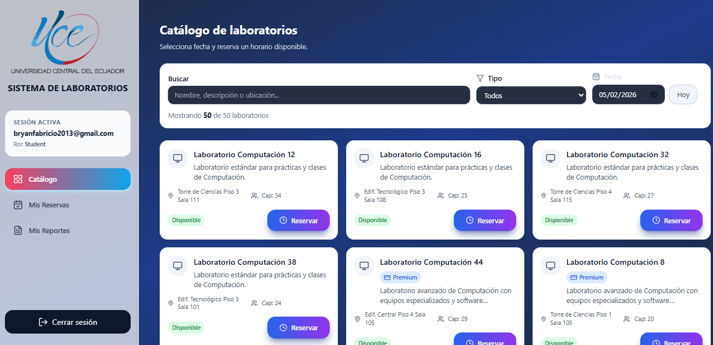

# 🧪 Laboratory Reservation Management System

### Dockerized Full-Stack Application | AWS EC2 Ready

A **production-ready laboratory reservation platform** designed for academic institutions at **Universidad Central del Ecuador (UCE)**. The system supports **basic and premium lab reservations**, **secure online payments**, **incident reporting with images**, and a **role-based admin dashboard** with real-time analytics.

This project is **fully Dockerized** and **ready to be deployed on AWS EC2**, following real-world DevOps and security best practices.


---

## ✨ Key Features Overview

### 🎓 Student & Professor Features

* **Firebase Authentication** - Secure login with Google OAuth and email/password
* **Laboratory Catalog** - Browse available labs with real-time availability
* **Smart Reservations** - Book basic and premium laboratory sessions
* **Stripe Integration** - Secure online payments for premium reservations
* **Email Notifications** - Automatic confirmations for bookings and payments
* **Reservation History** - Track all your past and upcoming reservations
* **Incident Reporting** - Submit reports with image uploads for lab issues
* **Dashboard** - Personalized view of reservations and activity


### 🛠️ Admin Features

* **Role-Based Access Control** - Admin and professor roles with specific permissions
* **User Management** - Manage student and professor accounts
* **Laboratory Configuration** - Control lab availability and schedules
* **Reservation Monitoring** - Real-time view of all laboratory bookings
* **Incident Reports Dashboard** - Review and manage submitted reports
* **Analytics** - Statistics on usage, popular labs, and revenue
* **System Configuration** - Manage operating hours and reservation rules


---

## 🏗️ System Architecture

```
Client (Browser)
   │
   ▼
Frontend (React + Vite + TailwindCSS)
   │
   ▼
Backend API (Node.js + Express)
   │
   ├── Firebase Authentication & Firestore
   ├── Stripe Payments & Webhooks
   ├── Firestore (Users / Labs / Reservations)
   ├── MongoDB (Incident Reports)
   └── Backblaze B2 (Private Image Storage)
```

### Technology Stack

**Frontend:**
- React 18 with Vite
- TailwindCSS for styling
- React Query for data fetching
- React Router for navigation
- Luxon for date/time management
- React Hot Toast for notifications

**Backend:**
- Node.js + Express
- Firebase Admin SDK
- Stripe SDK for payments
- MongoDB with Mongoose
- AWS S3 SDK (Backblaze B2)
- Multer for file uploads

**Infrastructure:**
- Docker & Docker Compose
- Firebase (Authentication & Firestore)
- MongoDB (incident reports)
- Backblaze B2 (image storage)
- Stripe (payments)

---

## 🐳 Dockerized Stack

| Service    | Description                       | Port |
| ---------- | --------------------------------- | ---- |
| frontend   | React + Vite development server   | 5173 |
| backend    | Node.js Express API               | 5000 |
| mongo      | MongoDB for incident reports      | 27017|
| mongo_gui  | Mongo Express (dev only)          | 8081 |

**External Managed Services:**
- Firebase Authentication & Firestore
- Stripe Payment Processing
- Backblaze B2 (S3-compatible storage)



---

## 📁 Project Structure

```
gestion_laboratorios/
├── Backend/
│   ├── controllers/          # Request handlers
│   ├── middleware/           # Auth & validation
│   ├── models/               # MongoDB schemas
│   ├── routes/               # API endpoints
│   ├── config/               # Firebase config
│   ├── Dockerfile
│   ├── .env
│   └── server.js
├── Frontend/
│   ├── src/
│   │   ├── features/         # Feature-based modules
│   │   │   ├── admin/        # Admin dashboard
│   │   │   ├── auth/         # Login & register
│   │   │   ├── catalog/      # Lab catalog
│   │   │   ├── my-reservations/
│   │   │   └── reports/      # Incident reports
│   │   ├── shared/           # Shared components
│   │   ├── hooks/            # Custom React hooks
│   │   └── services/         # API clients
│   ├── Dockerfile
│   ├── .env
│   └── vite.config.js
├── screenshots/              # Project screenshots
├── docker-compose.yml
└── README.md
```

---

## 🚀 Quick Start

### Prerequisites

- Docker & Docker Compose installed
- Firebase project setup
- Stripe account
- Backblaze B2 bucket (or any S3-compatible storage)

### 1. Clone the Repository

```bash
git clone https://github.com/BryanS1996/Gestion_Laboratorios.git
cd gestion_laboratorios
```

### 2. Configure Environment Variables

**Backend (.env)**
```env
PORT=5000
NODE_ENV=development

# Firebase
FIREBASE_PROJECT_ID=your_project_id

# Stripe
STRIPE_SECRET_KEY=sk_test_...
STRIPE_WEBHOOK_SECRET=whsec_...

# Backblaze B2
B2_KEY_ID=your_key_id
B2_APPLICATION_KEY=your_app_key
B2_BUCKET_NAME=your_bucket
B2_ENDPOINT=https://s3.us-west-000.backblazeb2.com

# MongoDB
MONGO_URI=mongodb://mongo:27017/laboratorios
```

**Frontend (.env)**
```env
VITE_API_URL=http://localhost:5000/api
VITE_STRIPE_PUBLIC_KEY=pk_test_...

# Firebase Config
VITE_FIREBASE_API_KEY=your_api_key
VITE_FIREBASE_AUTH_DOMAIN=your_domain
VITE_FIREBASE_PROJECT_ID=your_project_id
VITE_FIREBASE_STORAGE_BUCKET=your_bucket
VITE_FIREBASE_MESSAGING_SENDER_ID=your_sender_id
VITE_FIREBASE_APP_ID=your_app_id
```

### 3. Start the Application

```bash
# Build and start all services
docker compose up --build

# Or run in detached mode
docker compose up -d --build
```

### 4. Access the Application

- **Frontend:** http://localhost:5173
- **Backend API:** http://localhost:5000
- **Mongo Express:** http://localhost:8081


---

## ☁️ AWS EC2 Deployment

### EC2 Instance Requirements

- **Instance Type:** t2.medium or larger
- **OS:** Ubuntu 22.04 LTS
- **Storage:** 20GB minimum
- **Security Group:** Open ports 22, 80, 443, 5000, 5173

### Deployment Steps

```bash
# 1. SSH into your EC2 instance
ssh -i your-key.pem ubuntu@<EC2_PUBLIC_IP>

# 2. Install Docker
sudo apt update
sudo apt install -y docker.io docker-compose
sudo usermod -aG docker ubuntu
newgrp docker

# 3. Clone repository
git clone https://github.com/BryanS1996/Gestion_Laboratorios.git
cd gestion_laboratorios

# 4. Configure environment variables
# Edit .env files in Backend/ and Frontend/

# 5. Update Frontend API URL
# In Frontend/.env set VITE_API_URL to your EC2 public IP:
# VITE_API_URL=http://<EC2_PUBLIC_IP>:5000/api

# 6. Start the application
docker compose up -d --build

# 7. Check logs
docker compose logs -f
```

### Production Considerations

For production deployment, consider:

1. **Nginx Reverse Proxy** - SSL/TLS with Let's Encrypt
2. **Environment Isolation** - Separate dev/staging/prod environments
3. **Database Backups** - Regular MongoDB backups
4. **Monitoring** - CloudWatch or similar service
5. **CI/CD Pipeline** - GitHub Actions for automated deployments

---

## 🔐 Security Features

✅ **Authentication & Authorization**
- Firebase ID Token validation
- Custom JWT normalization
- Role-based access control (Admin, Professor, Student)
- Protected routes on frontend and backend

✅ **Payment Security**
- Stripe Checkout for PCI compliance
- Webhook signature verification
- Metadata validation (userId, reservationId)
- No credit card data stored

✅ **Data Protection**
- Private image storage (no public buckets)
- Pre-signed URLs for temporary access
- Environment variables for secrets
- Docker network isolation

✅ **API Security**
- CORS configuration
- Rate limiting (recommended)
- Input validation
- Error handling without leaking sensitive info

---

## 📊 Recent Improvements

### UI Enhancements (February 2026)

✨ **Dark Theme Consistency**
- Unified gradient background across all pages
- Improved text contrast for better readability
- Professional glassmorphism effects
- Consistent color palette (slate/blue/purple)

✨ **Form Visibility Fixes**
- All labels now use proper dark text on light backgrounds
- Input fields with optimized contrast ratios
- Better focus states for accessibility
- Consistent button styling across admin panel

✨ **Admin Panel Updates**
- User role management (Student/Professor)
- Real-time cache invalidation
- Improved search with 3-second debounce
- Enhanced filter components with proper styling

✨ **Configuration Page**
- Modern input styling with dark backgrounds
- Clear label visibility
- Professional card layouts
- Consistent spacing and typography

---

## 🧪 Testing

### Manual Testing Checklist

- [ ] User registration and login
- [ ] Laboratory catalog browsing
- [ ] Create basic reservation
- [ ] Create premium reservation (payment flow)
- [ ] Submit incident report with image
- [ ] Admin: view all reservations
- [ ] Admin: manage user roles
- [ ] Admin: view incident reports

### Stripe Test Cards

```
Success: 4242 4242 4242 4242
Decline: 4000 0000 0000 0002
3D Secure: 4000 0027 6000 3184
```

---

## 📖 API Documentation

### Authentication Headers

```
Authorization: Bearer <Firebase_ID_Token>
```

### Key Endpoints

**Public**
- `GET /api/laboratorios` - List all laboratories
- `POST /api/auth/register` - Register new user
- `POST /api/auth/login` - Login user

**Protected (Student/Professor)**
- `POST /api/catalogpage/reservacion` - Create reservation
- `GET /api/my-reservations` - Get user reservations
- `POST /api/reportes` - Submit incident report
- `POST /api/create-checkout-session` - Stripe payment
- `POST /api/webhook` - Stripe webhook handler

**Admin Only**
- `GET /api/admin/users` - List all users
- `PATCH /api/admin/users/:uid/role` - Update user role
- `GET /api/admin/laboratorios/estado` - Lab status
- `GET /api/admin/reportes` - All incident reports

---

## 🔮 Future Enhancements

### Planned Features

- [ ] **Real-time Notifications** - WebSocket integration for live updates
- [ ] **Mobile App** - React Native companion app
- [ ] **Advanced Analytics** - Usage trends and predictions
- [ ] **Email Templates** - Rich HTML email notifications
- [ ] **Calendar Integration** - Export reservations to Google Calendar
- [ ] **Multi-language Support** - English/Spanish toggle
- [ ] **Automated Testing** - Unit and integration tests
- [ ] **CI/CD Pipeline** - GitHub Actions workflow

### Infrastructure Improvements

- [ ] Nginx reverse proxy with SSL
- [ ] Redis caching layer
- [ ] Elasticsearch for advanced search
- [ ] Prometheus + Grafana monitoring
- [ ] Automated database backups
- [ ] Load balancing for scalability

---

## 📌 Best Practices Implemented

✅ **Code Organization**
- Feature-based folder structure
- Separation of concerns
- Reusable components
- Custom hooks for logic reuse

✅ **State Management**
- React Query for server state
- Context API for auth state
- Optimistic updates
- Cache invalidation strategies

✅ **DevOps**
- Containerized architecture
- Multi-stage Docker builds
- Environment-based configuration
- Health checks and logging

✅ **UX/UI**
- Responsive design (mobile-first)
- Loading states and skeletons
- Error handling with user feedback
- Accessibility considerations

---

## 🤝 Contributing

Contributions are welcome! Please feel free to submit a Pull Request.

1. Fork the repository
2. Create your feature branch (`git checkout -b feature/AmazingFeature`)
3. Commit your changes (`git commit -m 'Add some AmazingFeature'`)
4. Push to the branch (`git push origin feature/AmazingFeature`)
5. Open a Pull Request

---

## 👤 Author

**Bryan Chileno**  
Software Engineering Student | Full-Stack Developer  
Universidad Central del Ecuador  

**Tech Stack:** React · Node.js · Docker · AWS · Firebase · Stripe · MongoDB

**Connect:**
- GitHub: [@BryanS1996](https://github.com/BryanS1996)

---

## 📄 License

This project is open source and available for educational purposes.

---

## 🙏 Acknowledgments

- Universidad Central del Ecuador - Facultad de Ingeniería
- Firebase for authentication and database services
- Stripe for secure payment processing
- Backblaze for reliable cloud storage

---

[](https://deepwiki.com/BryanS1996/Gestion_Laboratorios)

> **Note:** This project follows real-world production patterns including secure payments, private storage, role-based access control, and containerized cloud deployment. It demonstrates proficiency in modern full-stack development, DevOps practices, and cloud architecture.

---

**Last Updated:** February 2026  
**Version:** 2.0.0  
**Status:** Production Ready 🚀
